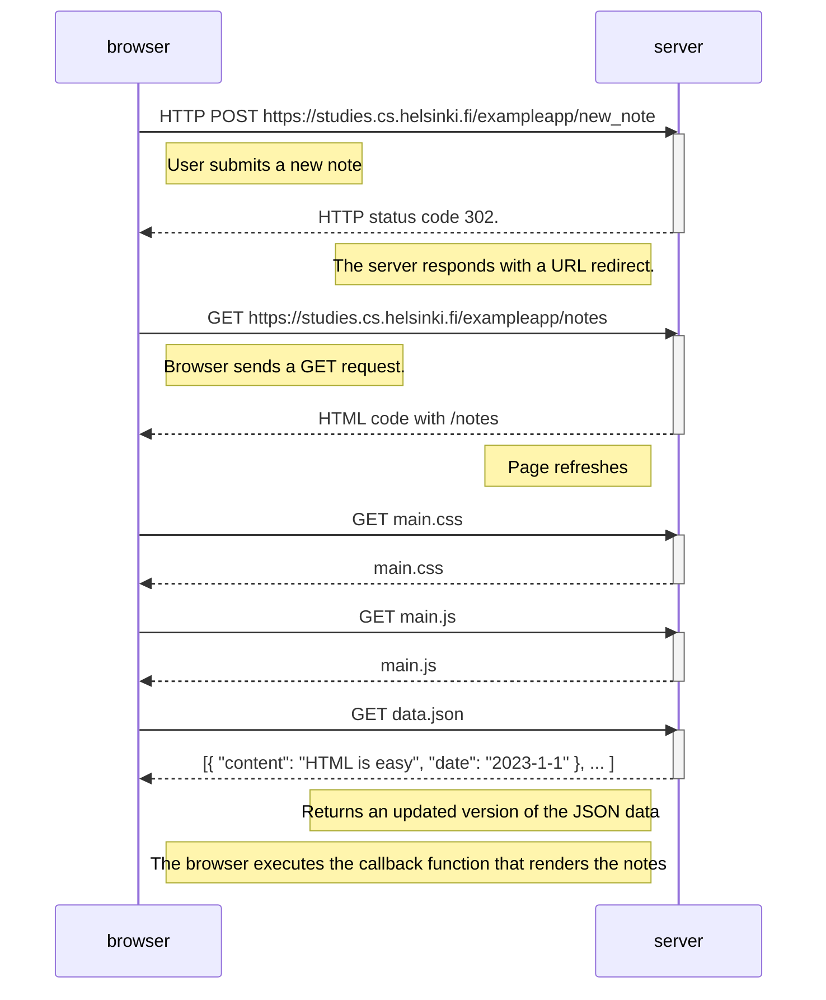

# 0.4: New note diagram

```mermaid
sequenceDiagram
    participant browser
    participant server

    browser->>server: HTTP POST https://studies.cs.helsinki.fi/exampleapp/new_note
    activate server
    Note right of browser: User submits a new note

    server-->>browser:  HTTP status code 302.
    deactivate server
    Note left of server: The server responds with a URL redirect.

    browser->>server: GET https://studies.cs.helsinki.fi/exampleapp/notes
    activate server
    Note right of browser: Browser sends a GET request.

    server-->>browser:  HTML code with /notes
    deactivate server
    Note left of server: Page refreshes

    browser->>server: GET main.css
    activate server
    server-->>browser:  main.css
    deactivate server

    browser->>server: GET main.js
    activate server
    server-->>browser:  main.js
    deactivate server

    browser->>server: GET data.json
    activate server
    server-->>browser: [{ "content": "HTML is easy", "date": "2023-1-1" }, ... ]
    deactivate server
    Note left of server: Returns an updated version of the JSON data

    Note right of browser: The browser executes the callback function that renders the notes
```

# 0.5: New note diagram
